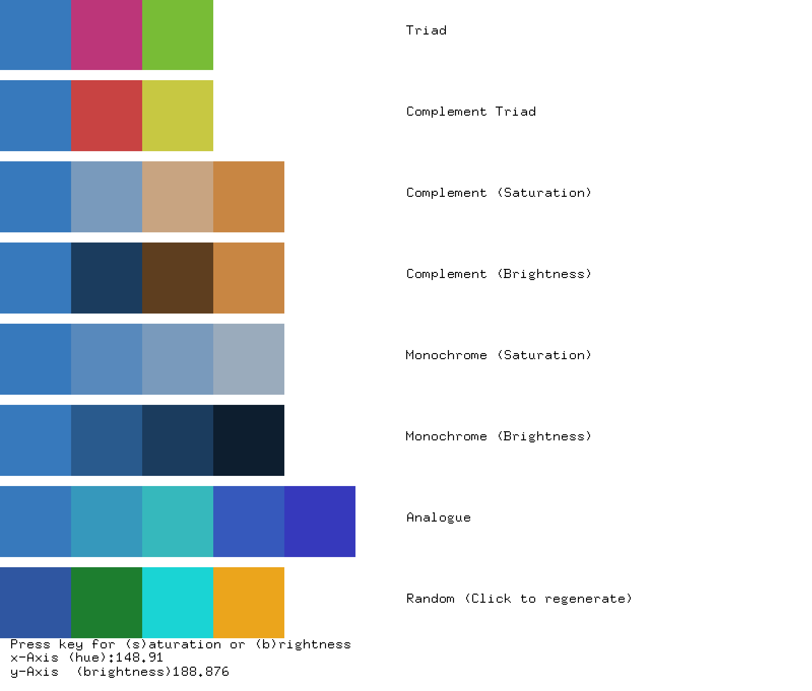

ofxColorPalette
===============

openFrameworks addon for algorithmic generated color palettes. The ofxColorPalette is templated, so ofColor corresponds to ofxColorPalette, ofShortColor to ofxShortColorPalette and ofFloatColor to ofxFloatColorPalette.

Use Triads and Complement to create tension. Use Monochrome and Analogue to radiate a sense of calm. Don't use Random! It hurts my eyes!

